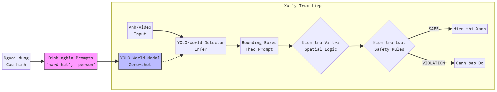
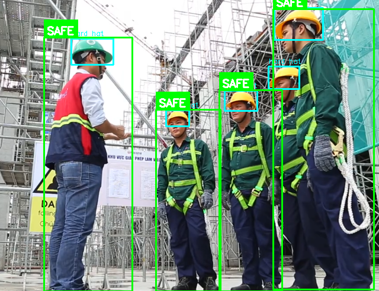
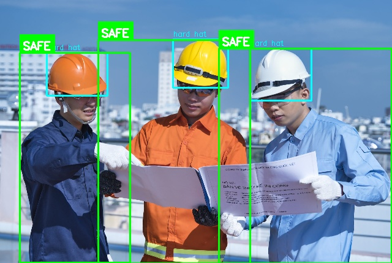
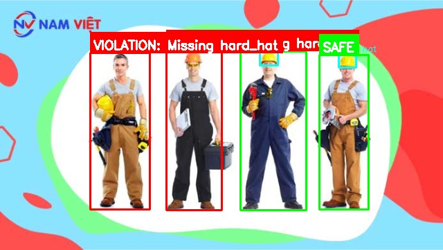
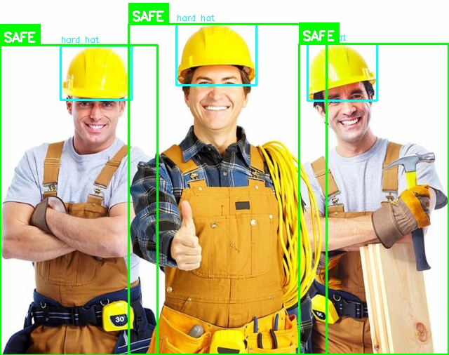
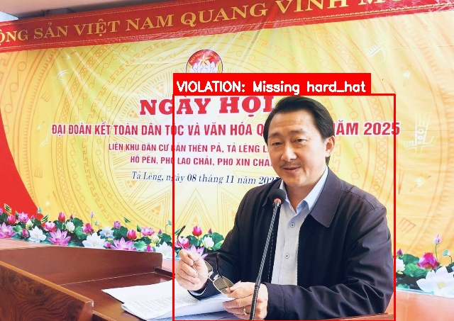
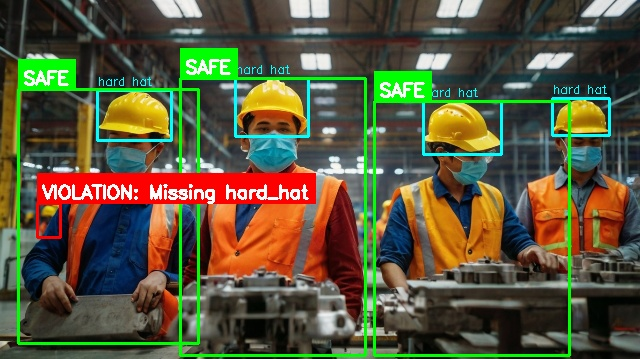
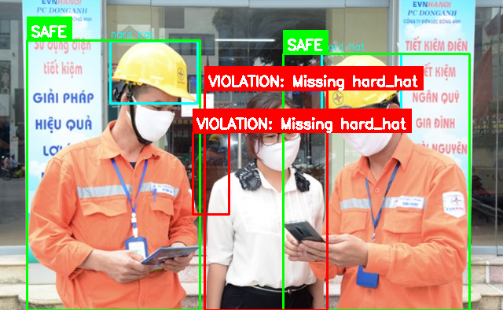

# Semantic Surveillance: He thong Giam sat An toan Lao dong Thong minh


Chuong trinh giam sat viec tuan thu trang bi bao ho lao dong (PPE) tren cong truong xay dung. Du an ho tro hai che do hoat dong: **Che do San xuat (Production)** su dung mo hinh YOLOv8 da duoc huan luyen va **Che do Nghien cuu (Future)** su dung YOLO-World (Zero-shot).

---

## Tinh nang chinh

*   **Kien truc kep - Giai quyet Bai toan Du lieu**:
    *   **Che do Chuyen dung (Production - YOLOv8)**: Su dung mo hinh chuyen biet da duoc huan luyen ky luong (fine-tuned) de dat do chinh xac va toc do toi uu nhat cho cac thiet bi co dinh.
    *   **Che do Linh hoat (Open Vocabulary - YOLO-World)**: Tinh nang mo rong dot pha giup giai quyet han che cua cac mo hinh truyen thong (ton thoi gian gan nhan du lieu - labeling). Cho phep he thong nhan dien bat ky thiet bi moi nao chi bang cach khai bao ten (Text Prompt) ma **khong can gan nhan va huan luyen lai**, tiet kiem dang ke thoi gian va cong suc trien khai.
*   **Thiet ke Module**: Tach biet ro rang giua Lop Nhan dien (Detection), Gop Thiet bi (Spatial Association) va Kiem tra Quy tac An toan (Safety Rules).
*   **Logic Kiem tra Thong minh**: 
    *   Kiem tra vi tri nghiem ngat (Vi du: Non bao ho phai o tren dau).
    *   Quy tac an toan linh hoat qua file cau hinh.
*   **Hien thi Truc quan**: Ve khung bao (bounding box) cho thiet bi (Mau vang/Cam) va Trang thai tuan thu (Xanh/Do).

---

## Cau truc Du an

```
ROOT/
├── main.py                  # Diem khoi chay chinh cho Video/Camera (Production)
├── train_ppe.py             # Script huan luyen mo hinh
├── requirements.txt         # Cac thu vien phu thuoc
│
├── config/                  # Cau hinh he thong
│   ├── config_yolov8_production.yaml  # Cau hinh cho Model da train (Best.pt)
│   └── config_yoloworld_future.yaml   # Cau hinh cho Model Zero-shot (Nghien cuu)
│
├── core/                    # Logic cot loi (Core Business Logic)
│   ├── detector.py          # Wrapper cho YOLOv8Detector (Prod) & YOLOWorldDetector (Future)
│   ├── ppe_checker.py       # Logic kiem tra an toan (Associator + Validator)
│   └── visualizer.py        # Logic ve va hien thi
│
├── scripts/                 # Cac script tien ich
│   └── test_images.py       # Script chy thu nghiem hang loat tren anh (Future Mode)
│
├── weights/                 # Trong so mo hinh (Model Weights)
│   ├── yolo8s_ppedetect_50e_best.pt              # Model da train
│   └── yolov8n-world.pt     # Model Zero-shot
│
└── runs/                    # Ket qua dau ra
```

---

## Cai dat

1.  **Clone ma nguon**:
    ```bash
    git clone https://github.com/ti014/semantic_surveillance.git
    cd semantic_surveillance
    ```

2.  **Cai dat thu vien**:
    ```bash
    pip install -r requirements.txt
    ```

---

## Huong dan Su dung

### 1. Che do San xuat (Demo Video)
Phu hop nhat de bao cao ket qua cuoi cung tren video. Su dung mo hinh da duoc huan luyen ky.

```bash
# Chay tren file video
python main.py --config config/config_yolov8_production.yaml --source bao-ho-lao-dong.mp4

# Luu ket qua ra file video
python main.py --config config/config_yolov8_production.yaml --source bao-ho-lao-dong.mp4 --save-path output/demo.mp4
```

### 2. Che do Nghien cuu (Tap du lieu Anh)
Phu hop de thu nghiem kha nang Zero-shot tren mot folder chua anh.

```bash
# Chay thu nghiem tren folder 'images_test'
python scripts/test_images.py --config config/config_yoloworld_future.yaml --source images_test --output output/future_test
```

---

## Chi tiet Kien truc

He thong tuan thu mau thiet ke **Facade + Component** trong thu muc `core/`:

1.  **`EquipmentAssociator`**: Tra loi cau hoi *"Non bao ho nay thuoc ve ai?"* su dung hinh hoc khong gian (IoU/IoE).
2.  **`SafetyRuleValidator`**: Tra loi cau hoi *"Nguoi nay co an toan khong?"* bang cach kiem tra quy tac trong file YAML.
3.  **`PPEChecker`**: Lop dieu phoi toan bo quy trinh kiem tra.

---

## Cau hinh

*   **Production**: Dieu chinh `confidence_threshold` (nguong tin cay) va `iou_threshold` trong `config/config_yolov8_production.yaml`.
*   **Future**: Thay doi các `prompts` (tu khoa nhan dien) trong `config/config_yoloworld_future.yaml`.

---

## Mo ta Luong Xu ly (Process Flow)

### 1. Luong Chuyen dung (Production Workflow - YOLOv8)
Quy trinh truyen thong: Can chuan bi du lieu va huan luyen ky luong.

### 2. Luong Linh hoat (Open Vocabulary Workflow - YOLO-World)
Quy trinh hien dai: **Bo qua buoc Gan nhan va Huan luyen**.



## Ket qua Thu nghiem (Demo Results)
Ket qua chay tren Che do Nghien cuu (YOLO-World):

| | | | |
|:---:|:---:|:---:|:---:|
|  |  |  |  |
|  |  |  |  |

---
Author: Phuong Phan Nguyen Mai & Hoang Ngo Quoc